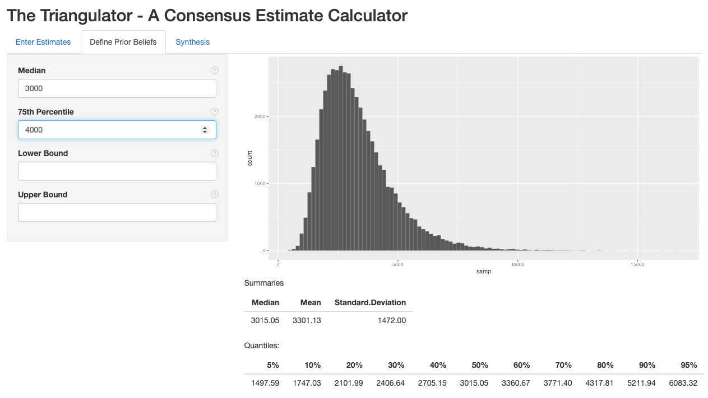
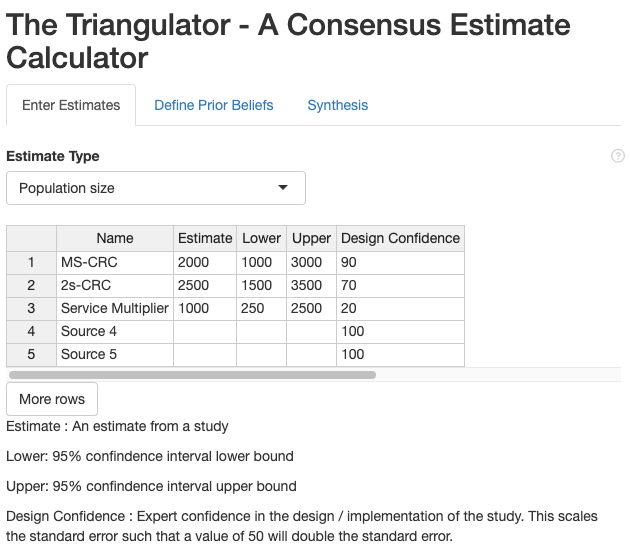
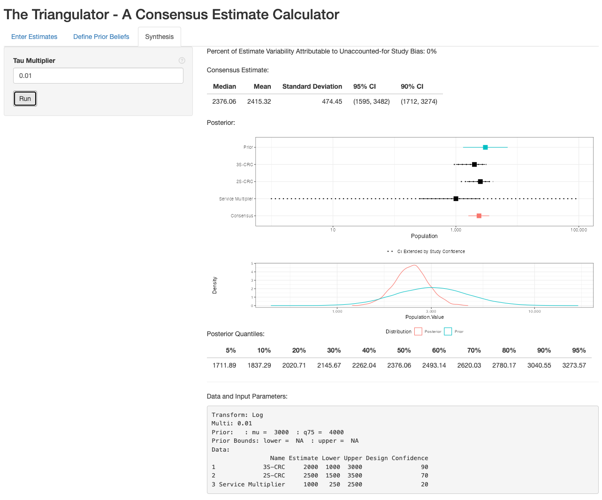

<script type="text/x-mathjax-config">
    MathJax.Hub.Config({
      tex2jax: {
        skipTags: ['script', 'noscript', 'style', 'textarea', 'pre'],
        inlineMath: [['$','$']]
      }
    });
  </script>
  <script src="https://cdn.mathjax.org/mathjax/latest/MathJax.js?config=TeX-AMS-MML_HTMLorMML" type="text/javascript"></script> 
    
# Triangulator

The Triangulator is a Shiny user interface designed to help derive consensus estimates of a population quantity (e.g. a population size, a proportion, a mean, etc.) from multiple empirical estimates. Underlying the application is a Bayesian multi-level model, and the steps of the consensus process proceed as follows:

1. Gather experts and stakeholders.
2. Obtain all available empirical estimates of the population quantity.
3. Elicit from them their beliefs about the plausible values of the population quantity (i.e. the prior).
4. With experts, evaluate the methodologies used to generate each estimate and assign it a "Study Confidence" from 0 to 100%.
5. Enter the above information into the Shiny application and run the analysis to get a consensus estimate.
6. Report the consensus estimate and its credible interval. Additionally, report information in the "Data and Input Parameters" field so that the estimate is reproducible and the stakeholder decisions are fully inspectable.

This document will guide you through the above steps. The mathematical details can be found [here](math.html)

## 0. Launch the Triangulator Application

The Triangulator is hosted on the [EpiApps.com](https://www.epiapps.com) website and may be run there. Alternatively, it may be run locally using R. 

The Triangulator may be installed from [GitHub](https://github.com/fellstat/triangulator) with:

``` r
# install.packages("devtools")
devtools::install_github("fellstat/triangulator")
```

Launch the Shiny application with:

``` r
library(triangulator)
launch_triangulator()
```

## 1. Gather Experts and Stakeholders

Experts and stakeholders understand the population of interest and the studies that have been performed in it. Their guidance will be used to define prior beliefs about the distribution of the population quantity and the quality of the studies. These individuals should also be in a position to sign off on the consensus estimate for public release.

## 2. Obtain Empirical Estimates

An empirical estimate is one that has been generated through a defined data collection process with at least some level of statistical validity. Examples used in [HIV key populations](https://www.theglobalfund.org/en/key-populations/) include:

**Population Size**

- [Two Source Capture recapture](https://en.wikipedia.org/wiki/Mark_and_recapture)
- [Service Multiplier](https://pubmed.ncbi.nlm.nih.gov/28912117/)
- [Event Multiplier](https://pubmed.ncbi.nlm.nih.gov/28912117/)
- [Multiple Source Capture Recapture](https://fellstat.github.io/shinyrecap/)
- [Network Scale-up (NSUM)](https://sti.bmj.com/content/sextrans/86/Suppl_2/ii11.full.pdf)
- [Respondent Driven Sampling Succsessive Sampling](https://onlinelibrary.wiley.com/doi/10.1111/biom.12255)
- [Privatized Network Sampling](https://doi.org/10.1093/jssam/smac010)

**Prevalence**

- [Respondent Driven Sampling](https://www.publichealth.columbia.edu/research/population-health-methods/respondent-driven-sampling)
- [Time Location Sampling](https://globalhealthsciences.ucsf.edu/sites/globalhealthsciences.ucsf.edu/files/tls-res-guide-2nd-edition.pdf)

Examples of estimates that are **NOT** empirical are:

- [Wisdom of the Crowd](https://link.springer.com/article/10.1007/s12599-010-0114-8) : Population members may or may not have an accurate understanding of the population quantity of interest. Instead of including this as an estimate it should be incorporated into the prior.
- **Expert Opinion or Previous Consensus Estimates** - Both expert opinion and consensus estimates based on older studies than the current set may be included through the prior elicitation.
- **Administrative or Service Counts** : The number of population members present in administrative records or who have been served by providers is informative for population size. However, since these are not statistically valid estimates, they should not be considered empirical. Instead, they should be included as lower bounds on the prior, which has the effect of disallowing any estimate of size below the count.

For each estimate, the following information should be obtained:

1. The point estimate
2. A confidence or credible interval.
3. Study methodology
    1. Study design
    2. Sample size
    3. Target population
    4. Sampling time period
4. Study implementation
    1. A summary of problems or challenges in the implementation of the design
    2. A summary of any design changes that were made during data collection

### Handling Missing Confidence Intervals

Intervals are required for the triangulation process. Without a measure of the uncertainty of an estimate, it is impossible to determine how much it should be trusted relative to other estimates. In some cases however, a study or report may only provide a point estimate and not an interval. There are a few strategies that may be used to generate an interval from available information.

#### Population Size

For two source capture recapture type estimates, which include service and event multipliers, the study will typically report the number of individuals in the first and second samples ($n_1$ and $n_2$). For service and event multipliers the first sample count is the service or event count. To construct an interval the number of people present in both the first and second samples is required. This may be reported, but if it is not the population size estimate ($\hat{N}$) can be used to recover it using the formula

$$n_{12} = \frac{n_1 n_2}{\hat{N}}.$$

A CRC [confidence interval calculator](https://www.quantitativeskills.com/sisa/statistics/crc.htm) may then be used to construct the interval.

To see a worked example click [here](prop.html).

#### Proportions (e.g. Prevalence, ART Coverage)

For a proportion with the point estimate ($\hat{p}$) reported and the sample size reported ($n$), the Wald 95% confidence interval is

$$\hat{p} \pm 1.96 \sqrt{\hat{p}(1-\hat{p})/n}.$$

For complex sampling designs, the [effective sample size](https://en.wikipedia.org/wiki/Design_effect) is often lower than the collected sample size. In these cases, $n$ should be adjusted by dividing by the study design effect. Design effects of 2 are often used for RDS studies and 1.5 for time location sampling. For example, if an RDS study with 300 individuals has a design effect of 2, $n$ in the confidence interval calculation should be 150. If a time location sample with 200 individuals has a design effect of 1.5, then $n$ should be 133.

For proportions calculated in a sub-population, $n$ should be multiplied by the proportion of individuals in the sub-population. For example, consider an estimate of the proportion of HIV positive individuals who are on ART (ART coverage) with the total sample size of 230. If the proportion of individuals who are HIV positive is 30%, then the $n$ that should be used would be $.3*230=69$. This number should be further divided by the study's design effect.

Wald intervals are not always ideal as they require larger sample sizes to meet their assumptions and can have intervals that are less than 0 or greater than 1. Wilson, or exact Clopper-Pearson intervals are preferred. To calculate these, first calculate as psuedo-count for the number of positive cases given $n$

$$n_+ = \hat{p}n.$$

Then use a [calculator](https://epitools.ausvet.com.au/ciproportion) to construct the intervals, rounding $n_+$ to the nearest integer.

To see a worked example click [here](prop.html).

#### Means

If the standard error ($\hat{\sigma}_{se}$) of the mean estimate ($\hat{m}$) is reported, then the interval may be constructed as

$$\hat{m} \pm 1.96 \hat{\sigma}_{se}.$$

If only the standard deviation ($\hat{\sigma}$) is reported then the interval is

$$\hat{m} \pm 1.96 \frac{\hat{\sigma}}{\sqrt{n}},$$

where $n$ should be calculated similarly to the proportion example.


## 3. Eliciting a Prior

The prior represents the current understanding of the quantity of interest and its uncertainty absent the empirical estimates included in the consensus process. As much as is possible, experts and stakeholders should ignore the information gained from the empirical estimates that are being used when constructing a prior.

[Prior elicitation is a art](https://www.cs.waikato.ac.nz/~eibe/pubs/Methods_for_Eliciting_Informative_Priors_-_FINAL.pdf) that requires some thought and care. The Triangulator requires a median value, such that the experts think that there is a 50% chance the true value is above and a 50% chance it is below. It also requires the 75% percentile of the distribution such that the experts think that there is a 25% chance the true value is above it and a 75% chance it is below. Optionally, lower and upper bounds may be specified.

Begin with the elicitation of the median. Pose the question 

<p align="center">
**What is your best guess for what the quantity is?** 
</p>

to each expert. Remind them to ignore the estimates that are going to be used. Record each value and then open a discussion two synthesize these into a single value for the whole group.

Next elicit the 75% percentile. Pose the question 

<p align="center">
**We are uncertain about what the quantity is. Maybe it is higher than our best guess and maybe lower. For some value larger than your best guess, you think that there is a 25% chance it is higher and a 75% chance it is lower. For what number do you think that the probability the quantity of interest exceeds this number is 25%?** 
</p>

The distribution type for the prior depends on the estimate type. For population size estimates, a log normal is used. For proportions, a logit normal distribution is used. For all others, a normal distribution is used. 

Select the appropriate estimate type in the "Enter Estimates" tab of The Triangulator. Then enter the median and 75% percentiles into the "Define Prior Beliefs" tab. The define prior beliefs tab can be used to refine the prior distribution and obtain a group consensus on it.

----------



----------

The above screenshot shows a population size estimate prior with median 3000 and 75% percentile 4000. The histogram represents the distribution. Ask each expert whether this is a reasonable representation of the uncertainty about the population quantity. If it does not, change the median and 75% percentile to refine the distribution.

The summary tables can also be useful in evaluating the reasonableness of the prior. Is it reasonable to think that there is a 20% chance the true value is above the 80th quantile? Is it reasonable to think that there is a 10% chance it is below the 10th?

Finally, lower and upper bounds can be added. For example, there may service lists and we know that the population size is larger than the number of individuals on the list. Thus, that number would be a lower bound. Similarly, the number of key population members in a city is lower than the number of people in the city, thus that may form an upper bound. The upper and lower bounds should be values beyond which the population quantity is very implausible.


## 4. Study Evaluation

There are two sources of error that can be present in an estimate of a population quantity. The first is sampling error, which is the uncertainty arising from the fact that we only collect a sample from the population and not everyone in the population. Sampling error is what is accounted for by confidence intervals. 

Non-sampling error is the error that arises from violation of the sampling assumptions and/or flawed study implementation. The potential non-sampling error can assessed by critically looking at the designs, their assumptions and any implementation challenges that were present. Non-sampling error is introduced into The Triangulator through the Design Confidence values.

Experts should evaluate each study and its potential for non-sampling error, scoring it between 0% (no confidence) and 100% (assumptions met + great implementation). The design confidence scales the standard error such that a value of 50% doubles the standard error and a value of 25% quadruples it.

## 5. Triangulator Analysis

With the values specified in the previous steps we are now in a position to perform the analysis. First, the estimates and design confidences are entered in the "Enter Estimates" tab. The estimate type (population size, proportion, mean and other) is also specified in this tab

### Enter Estimates

----------



----------

In the example screenshot above, we have three estimates. The first is three source capture recapture (3S-CRC). The second is a two source capture recapture (2S-CRC). The third is a service multiplier. 

The service multiplier is given a low confidence (20%) as the service list captures a very visible subset of the population and we are not confident that the list is independent of our second sample. The 2S-CRC is given a decently high confidence at 70%. The 3S-CRC is the most rigourous study and is given a confidence of 90%.

### Define Prior Beliefs

The "Define Prior Beliefs" tab is used to specify the prior. In our example, we will use the 3000 median and 4000 75th percentile discussed in step 3.

### Synthesis

The synthesis tab provides the posterior consensus estimate. 

The value of tau is the scale of how much bias exists across studies after accounting for the “Confidence” values. We set the prior scale for tau to be equal to a “multiplier” that is multiplied against the standard deviation of the estimates.

We typically want tau to be very small, indicating a belief that between study biases have been accounted for by specification of the “Confidence” values. However, if the data is inconsistent with that belief this should be picked up. A tau multiplier of 0.01 serves well in most cases.

----------



----------

The first value in the results is the "Percent of Estimate Variability Attributable to Unaccounted-for Study Bias," which is the estimate of the amount of non-sampling bias that was not accounted for by the design confidences specified by the user. If can range from 0 to 100%. If it is high, this indicates that the estimates are inconsistent with one another even after scaling up the standard errors using design confidence. If this is over 30%, consider reviewing the design confidences.

The top table displays the point estimate (Mean) as well as 90% and 95% credible intervals. The forest plot shows the prior, each individual estimate and the posterior. This is followed by a density plot comparing the prior to the posterior. If the prior looks very similar to the posterior, this indicates that the estimates are not adding any information, which can either indicate that the sample sizes for the estimates is too small to be informative, or our confidence in the studies is too low to get any inference out of them. The posterior is also summarized in the quantile table.

Finally, the Data and Input parameters are displayed. These values provide all of the information necessary to recreate the analysis. This information should be included in the report as it allows the analysis to be reproduced by a third party. It also shows the decisions that the experts made (i.e. the prior and study confidences), allowing the consensus process to be fully transparent.


